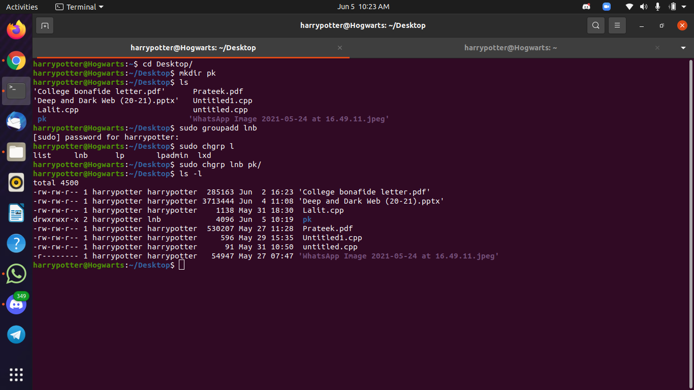
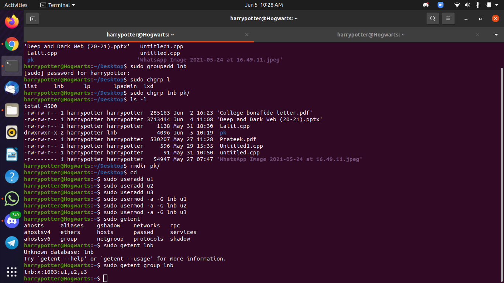
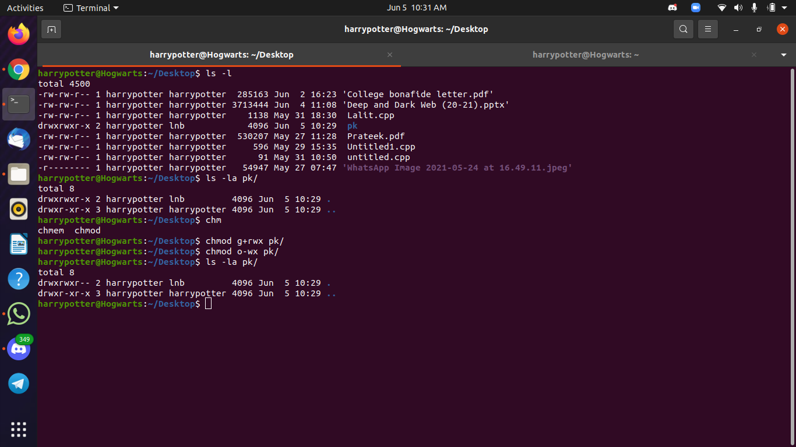

# TASK 1(B) 


## TASK 1(B) CODE
```
mkdir pk
ls
sudo groupadd lnb
sudo chgrp lnb pk/
ls -l
```
# TASK 1(C)


## TASK 1(C) CODE
```
sudo useradd u1
sudo useradd u2
sudo useradd u3
sudo usermod -a -G lnb u1
sudo usermod -a -G lnb u2
sudo usermod -a -G lnb u3
getent group lnb 
```
# TASK 1(D)


## TASK 1(D) CODE
```
ls
ls -la pk/
chmod g+rwx pk/
chmod o-wx pk/
ls -la pk/
```

# TASK 2 CODE
```
sudo apt-get remove package_name
```
