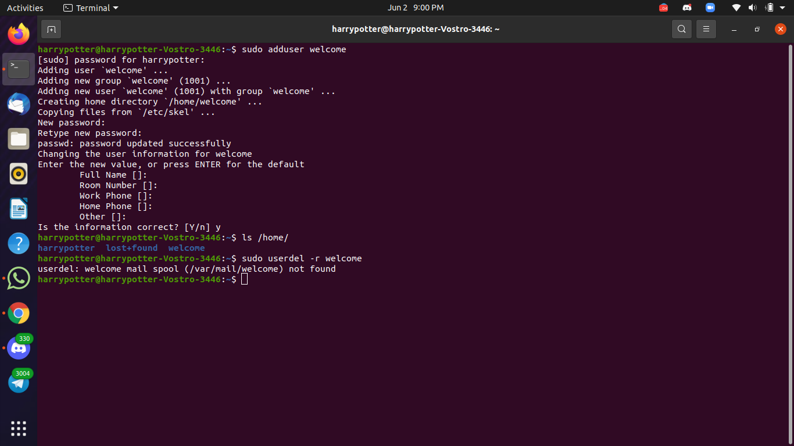
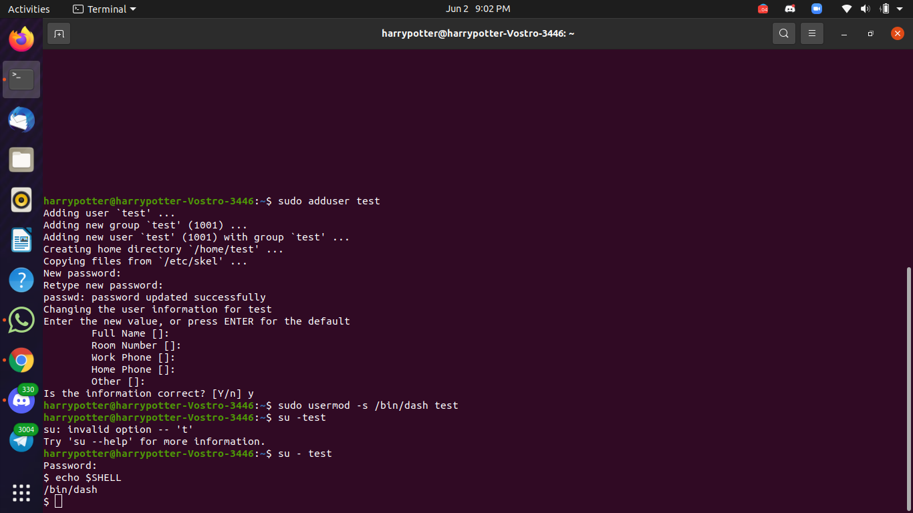
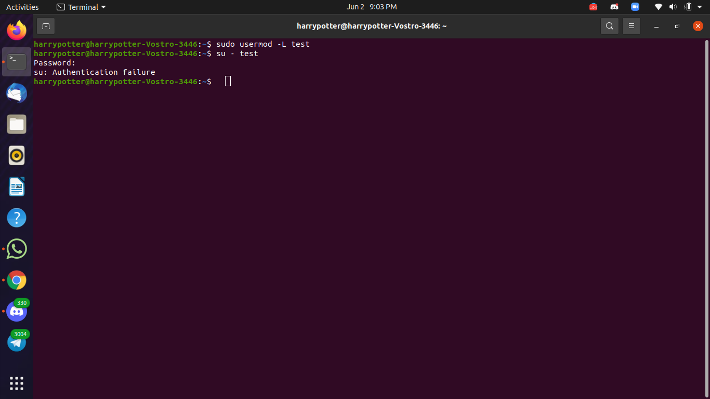

#TASK 1


##TASK 1 CODE
```
sudo adduser welcome
ls /home/
sudo userdel -r welcome
ls /home/
```


#TASK2(A)

##TASK2(A) CODE
```
sudo adduser test
sudo usermod -s /bin/dash test
su - test
echo $SHELL

```

#TASK2(B)


##TASK2(B) CODE

```
sudo usermod -L test
su - test
```
