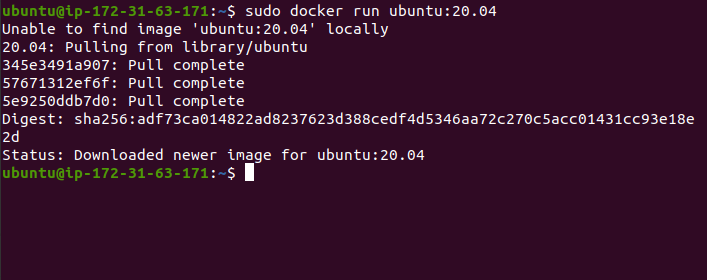

  ## Install Docker
```

   sudo apt-get update
   sudo apt-get install \
      apt-transport-https \
      ca-certificates \
      curl \
      gnupg \
      lsb-release
   curl -fsSL https://download.docker.com/linux/ubuntu/gpg | sudo gpg --dearmor -o /usr/share/keyrings/docker-archive-keyring.gpg
    echo \
    "deb [arch=amd64 signed-by=/usr/share/keyrings/docker-archive-keyring.gpg] https://download.docker.com/linux/ubuntu \
    $(lsb_release -cs) stable" | sudo tee /etc/apt/sources.list.d/docker.list > /dev/null
    sudo apt-get update
   sudo apt-get install docker-ce docker-ce-cli containerd.io
```


## Pull Docker Image ubuntu:20.04
```
sudo docker run ubuntu:20.04
```


## Start Pause and Stop the Docker container
```
sudo docker run ubuntu:20.04 sleep 100
sudo docker pause Docker_name 
sudo docker unpause Docker_name 
sudo docker stop Docker_name
```


## Get the bash of the container

```
sudo docker run -it ubuntu:20.04 bash
```


